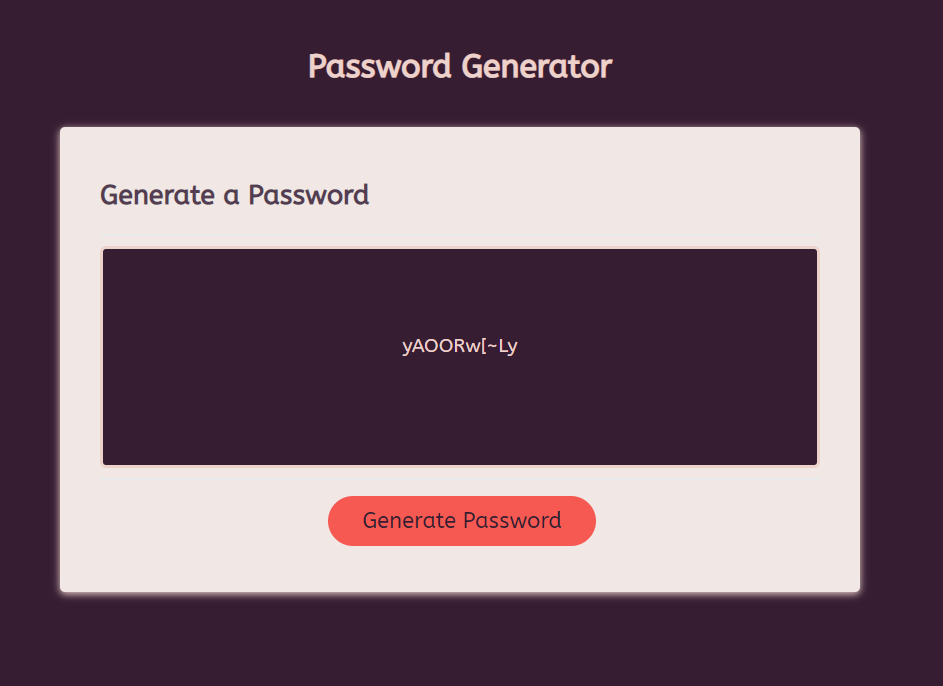

# password-generator
A JavaScript password generator that uses preset arrays of character types and allows the user to choose length and which character types they want to include

## Deployment

__[Github Repository](https://github.com/jbkennaugh/password-generator)__

__[Deployed Website](https://jbkennaugh.github.io/password-generator/)__

## Screenshot 

## License

Please refer to the LICENSE in the repository

## Credits

Credit to Google Fonts for their font 'ABeeZee'